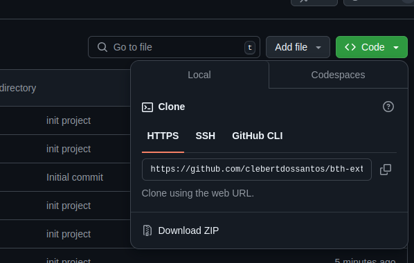
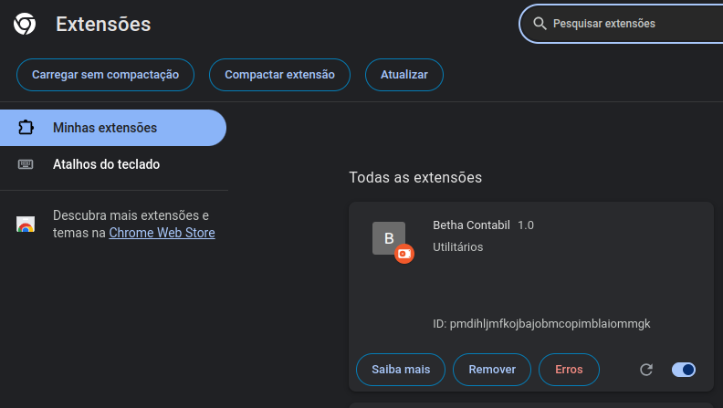
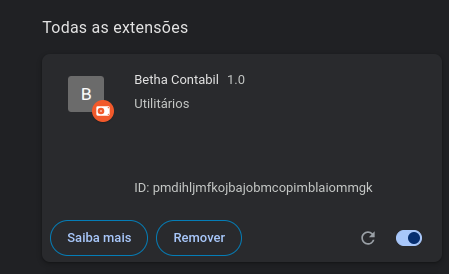
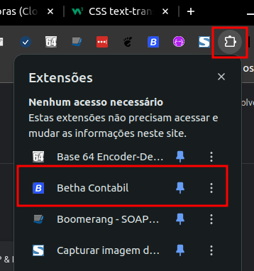
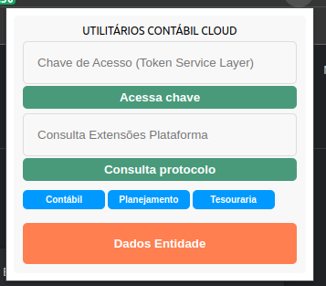

# bth-extension

Atalhos para facilitar a busca por contextos das aplicações, consulta de protocolos ou tokens utilizados nos sitemas.

### Download do projeto

1. Acesse um diretorio dentro da sua maquina para fazer o clone do projeto
2. Dentro da pasta desejada, abra o terminal e digite git clone 'endereço que aparece na imagem abaixo'
3. Pode ser feito o download do projeto baixando simplesmente o projeto todo como .zip (imagem abaixo)

### Ativar extensão

1. Abra seu Google Chrome
2. Acesse o menu, Extensões >> Gerenciar Extensões
3. Clique o botão 'Carregar sem compactação' (pasta tem que estar descompactada)
4. Escola a pasta onde você fez o download do projeto e vincule as extensões do google

### Marque a extensão como ativa

### Visibilidade dentro do navegador

Marque ela como ativa (pin)

### Funcionalidades

1. Consulta validade da chave de acesso de migração
2. Consulta o protocolo de execução de algum artefato da plataforma
3. Atalhos para acessar o swagger da linha de produtos Contábil (contábil, planejamento e tesouraria)
4. Consulta o contexto da entidade logada

